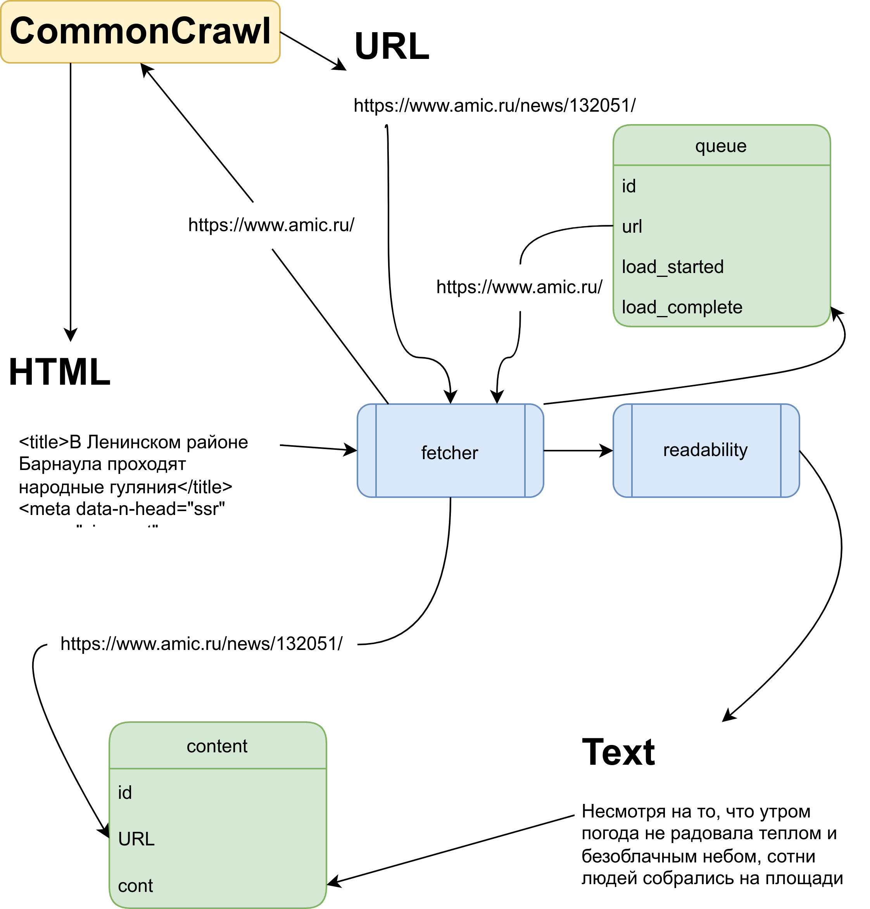

# Структура хранения данных
Как было сказано в введении базы данных бывают разных типов. В нашей конкретной задаче было достаточно обычной реляционной базы данных. Так как объемы информации не настолько большие чтобы выделять под это отдельный сервер и частота запросов невелика, было решено остановиться на базе данных Sqlite.

Загрузка информации происходит в несколько этапов:

1. Собираем список нужных новостных изданий.
1. Запись списка URL в базу данных в таблицу с именем queue колонку url.
1. Дальше в несколько процессов запускается скрипт загрузчика.
1. Загрузчик берет каждую запись из очереди.
1. При помощи API CommonCrawl получает ссылки на архивы для скачивания.
1. Пакетами, которые позволяет хранящий ресурс, данные загружаются в таблицу content.
1. Текст отправляется в колонку raw_cont, а адрес страницы в колонку url

Проиллюстрировать работу программы по загрузке и обработке информации можно следующей диаграммой [Рис. 1]




                Рис. 1: Иллюстрация работы загрузчика


## Структура таблиц:
```SQL 
TABLE man(id primary key, lastname, firstname, middlename, expert);
TABLE queue(
    id INTEGER PRIMARY KEY AUTOINCREMENT,
    url TEXT,
    load_started DEFAULT NULL,
    load_complete DEFAULT NULL
);
TABLE content(
    id INTEGER PRIMARY KEY AUTOINCREMENT,
    url TEXT,
    cont TEXT
);
```

Всего было выгружено 5Гб очищенных данных. Загрузка производилась в несколько процессов. Данные очищались на этапе получения от различных HTML тегов при помощи python библиотеки BeautifulSoup и проекта readability.

## Математическая модель структуры данных
Основана на реляционной алгебре. Так основным элементом являются мультимножества.

1. Отношение - это таблица или ее подмножество.

1. Кортеж - строка в талице.

1. Атрибут - столбец в таблице.

1. Поле - ячейка таблицы определенного типа.

1. Тип ячейки в таблице - некоторое число $a \in \mathbb{N}$, где $\mathbb{N}$ - множество натуральных чисел. 
    
    Соответствие типов:
    1. $t_1$ - целое число
    1. $t_2$ - текст (последовательность символов)
    1. $t_3$ - булевое значение (0 - Ложь, 1- Истина)
    1. $t_4$ - время


1. Множество уникальных элементов $U(name_1(t_1), ..., name_2(t_k))$ - набор уникальных кортежей, где у каждого кортежа есть $k$ атрибутов с именами $name_1,..., name_2$ соответствующими типам $t_1, ..., t_k$. Обозначение выборки определенных кортежей с атрибутами $name_n, ..., name_k$, у некоторых из которых задано целевое значение (например $name_t\in [10,20]$, a $name_s\in \{ \textup{Саша}, \textup{Маша}, \textup{Женя}\}$), будет выглядеть так: $\pi (U(name_n, ..., name_k))_{\sigma(name_t\in [10,20], \quad name_s\in \{ \textup{Саша}, \textup{Маша}, \textup{Женя}\})}$

1. Мультимножество ($M(U(t_1, ..., t_k))$) построенное на множестве уникальных элементов $U(t_1, ..., t_k)$ - это упорядоченная пара $(U, \varphi)$ такая, что
$\varphi: U \rightarrow \mathbb{N}$, где $\mathbb{N}$ - множество натуральных чисел, отображение $\varphi$ : $\forall x \in U$  $\exists y \in \mathbb{N}: \varphi(x) = y$. (дальше множество уникальных элементов будет опускаться)


В нашем случае имеется 3 мультимножества: 
1. $queue(id(t_1), url(t_2), load\texttt{\_}started(t_4), load\texttt{\_}complete(t_4))$
1. $content(id(t_1), url(t_2), cont(t_2))$
1. $man(id(t_1), lastname(t_2), firstname(t_2), middlename(t_2), expert(t_3))$

